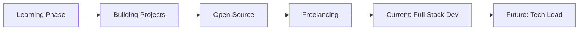

<div align="center">
  
# 

### 💫 **Transforming Ideas into Scalable Digital Solutions**

[](https://ahadporfolio.netlify.app/)
[](https://linkedin.com/in/ahadmuzaffar/)
[](mailto:muhammadahad211126@gmail.com)
[](https://www.leetcode.com/ahad-dev)
[](https://dev.to/ahad_dev)


</div>


## 📑 Table of Contents
- [About Me](#-about-me)
- [Tech Stack](#-tech-stack)
- [Featured Projects](#-featured-projects)
- [GitHub Analytics](#-github-analytics)
- [Achievements](#-achievements)
- [Professional Experience](#-professional-experience)
- [Let's Connect](#-lets-connect)


## 👨‍💻 About Me

```typescript
const muhammadAhad = {
    title: "Full Stack Developer",
    location: "Pakistan 🇵🇰",
    education: "Computer Science Student",
    currentFocus: ["System Design", "Next.js", "Machine Learning", "Web3"],
    workingOn: "SyncPad - Real-time Collaborative Platform",
    availableFor: "Full-stack Development | Open Source | Freelance Projects",
    
    quickFacts: {
        💡: "Problem solver at heart",
        🎯: "Clean code advocate",
        🚀: "Performance optimization enthusiast",
        ⚡: "Rubik's Cube solver (<1 min)",
        🌱: "Continuous learner"
    },
    
    askMeAbout: [
        "Web Development", "MERN Stack", "REST APIs", 
        "Database Design", "UI/UX", "System Architecture"
    ]
};
```

<details>
<summary>📌 <b>Current Focus & Goals</b></summary>
<br>

- 🔭 Building **[SyncPad](https://github.com/Ahad-dev/SyncPad)** - A feature-rich collaborative notes platform
- 🌱 Deepening expertise in **Next.js 14**, **Machine Learning**, and **Cloud Architecture**
- 🎯 Contributing to open-source projects and building dev tools
- 📚 Learning System Design patterns and scalable architecture
- 💼 Open to collaborating on innovative full-stack projects
- 🏆 Solving DSA problems daily on LeetCode

</details>


## 🛠️ Tech Stack

<div align="center">

### **Frontend Development**


### **Backend Development**


### **Programming Languages**


### **Data Science & ML**


### **Tools & Technologies**


</div>


## 🚀 Featured Projects

<div align="center">

<table>
<tr>
<td width="50%">

### 🔗 SyncPad
[](https://github.com/Ahad-dev/SyncPad)

**Real-time Collaborative Notes Platform**

A feature-rich collaborative workspace enabling teams to work together seamlessly with real-time synchronization, rich text editing, and workspace management.

**Tech:** React.js • Node.js • Socket.io • MongoDB • Express

**Features:**
- ⚡ Real-time collaboration
- 📝 Rich text editor
- 🔒 Secure authentication
- 🎨 Modern UI/UX

</td>
<td width="50%">

### 🌐 Developer Portfolio
[](https://ahadporfolio.netlify.app/)

**Personal Portfolio Website**

A modern, responsive portfolio showcasing my projects, skills, and professional journey with smooth animations and optimal performance.

**Tech:** React.js • TailwindCSS • Framer Motion

**Features:**
- 🎨 Modern design
- 📱 Fully responsive
- ⚡ Fast & optimized
- 🎭 Smooth animations

</td>
</tr>
</table>

<a href="https://github.com/Ahad-dev?tab=repositories">
  
</a>

</div>


## 📊 GitHub Analytics

<div align="center">
  


</div>

### 📈 Contribution Activity

<div align="center">
  


</div>

### 💻 Coding Activity

<div align="center">

<!--START_SECTION:waka-->
<!--END_SECTION:waka-->


</div>


## 🏆 Achievements

<div align="center">


### 🎯 Problem Solving
[](https://www.leetcode.com/ahad-dev)


### 📝 Content Creation
[](https://dev.to/ahad_dev)

### 🌟 Community Contributions


</div>


## 💼 Professional Experience



<div align="center">

| Role | Focus | Status |
|------|-------|--------|
| 🎓 **Student** | Computer Science | 📚 Ongoing |
| 💻 **Developer** | MERN Stack | 🚀 Active |
| 🌐 **Freelancer** | Web Development | ✅ Available |
| 📝 **Technical Writer** | Dev.to Articles | ✍️ Active |
| 🏆 **Problem Solver** | LeetCode | 💪 Daily |

</div>


## 💡 What I Can Help You With

<div align="center">

| Service | Description |
|---------|-------------|
| 🌐 **Full Stack Development** | Building scalable web applications with MERN stack |
| 🎨 **UI/UX Implementation** | Creating responsive and modern user interfaces |
| 🔧 **API Development** | Designing and implementing RESTful APIs |
| 🗃️ **Database Design** | Structuring efficient database schemas |
| 🚀 **Performance Optimization** | Improving application speed and efficiency |
| 🔍 **Code Review** | Providing constructive feedback on code quality |
| 📚 **Mentorship** | Helping beginners get started with web development |

</div>


## 📈 Weekly Development Breakdown

<!--START_SECTION:waka-->
<!--END_SECTION:waka-->


## 🎵 Vibing To

<div align="center">

[](https://open.spotify.com/user/ahad)

</div>


## 💭 Dev Quote of the Day

<div align="center">


</div>


## 🤝 Let's Connect

<div align="center">

### 📬 **Reach Out For**
Collaboration • Freelance Projects • Mentorship • Open Source • Just a Chat

<p>
  <a href="mailto:muhammadahad211126@gmail.com">
    
  </a>
</p>

<p>
  <a href="https://linkedin.com/in/ahadmuzaffar/">
    
  </a>
  <a href="https://dev.to/ahad_dev">
    
  </a>
  <a href="https://www.leetcode.com/ahad-dev">
    
  </a>
</p>

### 💼 Open for Opportunities


</div>


<div align="center">

### 🐍 Contribution Snake


### ⭐ From [Ahad-dev](https://github.com/Ahad-dev) | Let's Build Something Amazing Together!

**"Code is like humor. When you have to explain it, it's bad." – Cory House**


</div>
